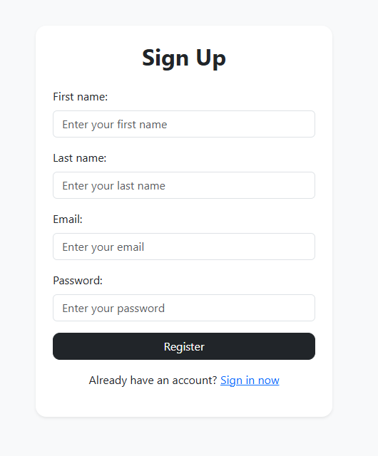
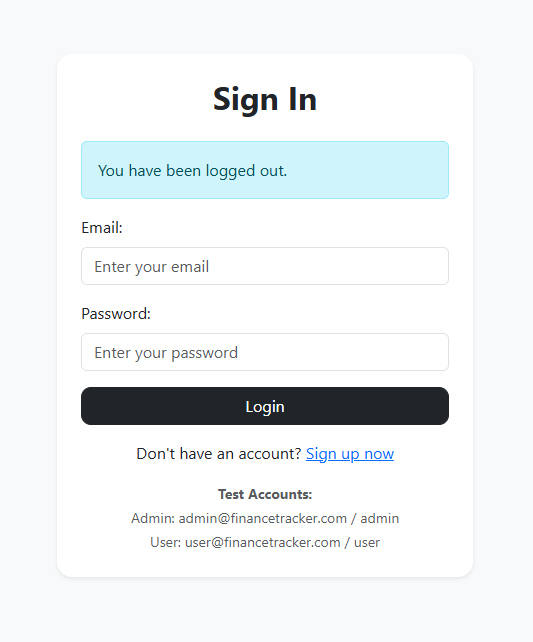
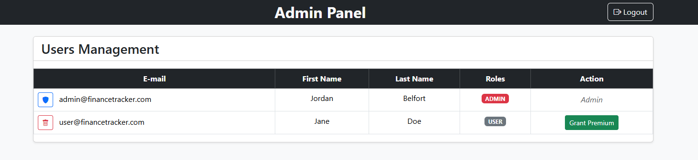
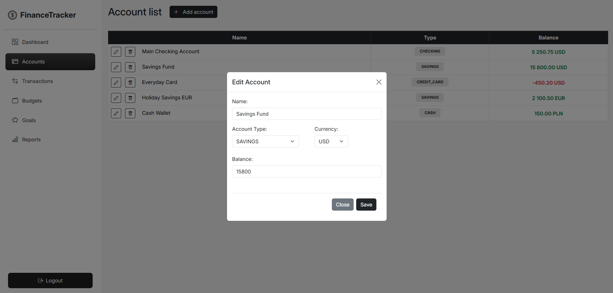
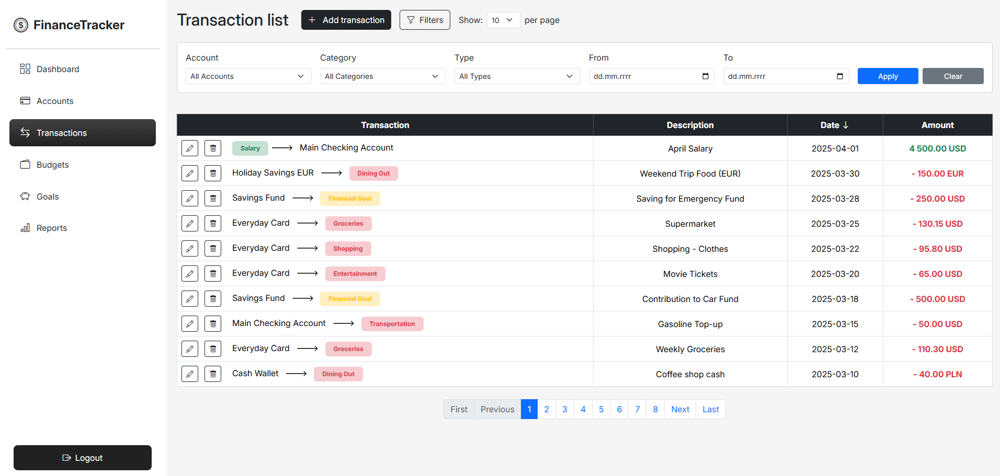
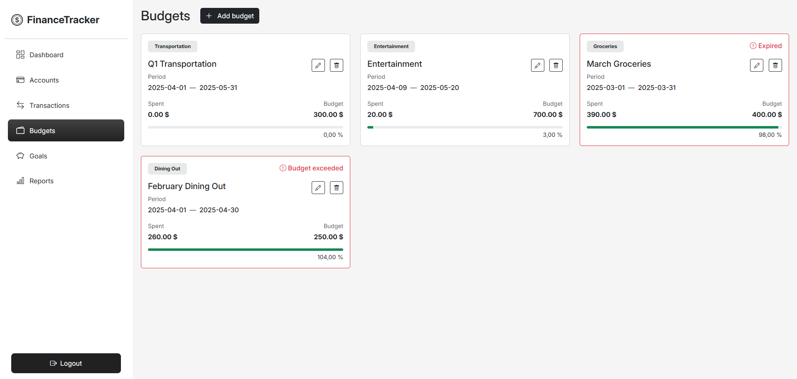
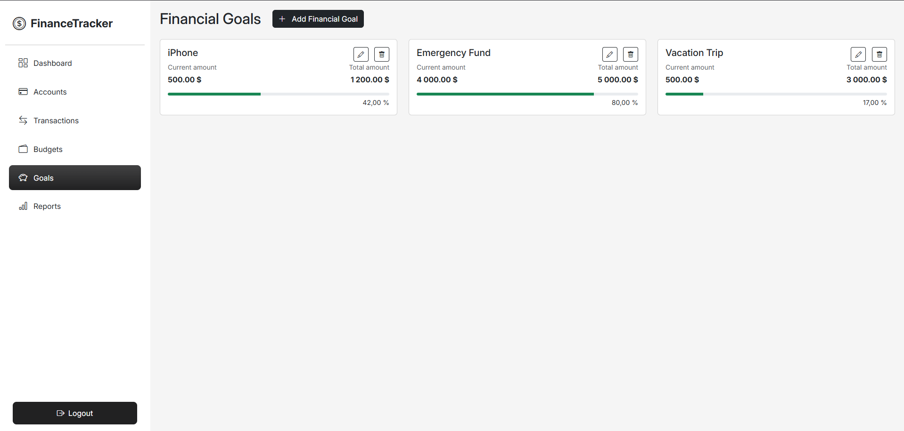
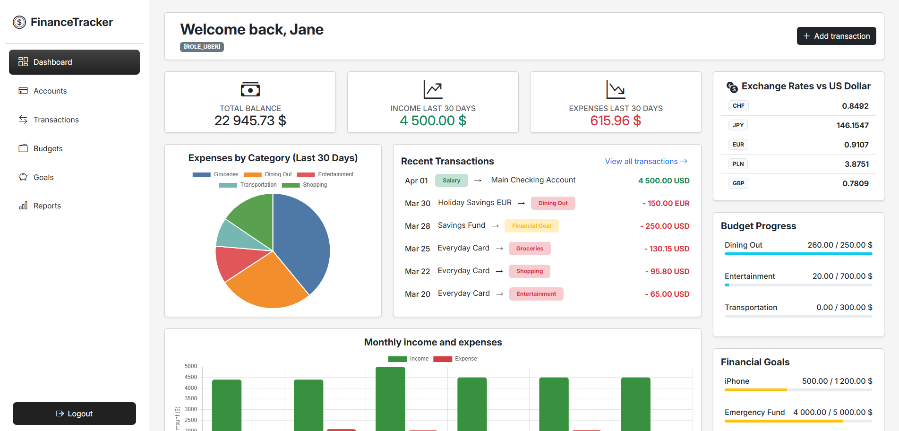

# FinanceTracker

## Table of contents

1.  [Overview](#overview)
2.  [Features](#features)
3.  [Tech Stack](#tech-stack)
4.  [Configuration](#configuration)
5.  [Database Migrations](#database-migrations)
6.  [Running the Application](#running-the-application)
7.  [Testing](#testing)
8.  [Future Enhancements](#future-enhancements)
9.  [License](#license)

## Overview

FinanceTracker is a web application designed to help users manage their personal finances effectively. It allows users to track their accounts, transactions, set budgets, and monitor progress towards financial goals. The application supports multiple currencies and provides visualizations of financial data.

## Features

*   **User Management:**
    *   Role-based access control (USER, PREMIUM, ADMIN).
    *   Secure user registration and login. <br/><br/>
    <table>
        <tr>
          <td></td>
          <td></td>
        </tr>
    </table><br/><br/>
    *   Admin panel for managing users (view, delete, grant/revoke PREMIUM role). <br/><br/>
     <br/><br/>
*   **Account Management:**
    *   Create, Read, Update, and Delete (CRUD) financial accounts.
    *   Supports various account types (SAVINGS, CHECKING, CREDIT_CARD, CASH).
    *   Handles multiple currencies (USD, EUR, PLN, GBP, CHF, JPY).
    *   Calculates and displays the total balance across all accounts, converted to a base currency (USD). <br/><br/>
     <br/><br/>
*   **Transaction Tracking:**
    *   Log income, expenses, and contributions towards financial goals.
    *   Link transactions to specific accounts and categories.
    *   Automatic account balance updates based on transactions.
    *   Filter transactions by account, category, type, and date range.
    *   Paginated view of transactions with sorting options. <br/><br/>
     <br/><br/>
*   **Budgeting:**
    *   Create, Read, Update, and Delete (CRUD) budgets for specific expense categories.
    *   Define budget periods (start and end dates).
    *   Automatically track spending against budgets based on relevant expense transactions.
    *   Visual progress bars to show budget utilization.
    *   Calculates spent amount in a base currency (USD) for consistent tracking across different account currencies. <br/><br/>
     <br/><br/>
*   **Financial Goals:**
    *   Set up, track, and manage personal financial goals (e.g., saving for a down payment).
    *   Allocate specific transactions towards goals.
    *   Automatically track the current amount saved towards each goal, converted to a base currency (USD).
    *   Visual progress bars and achievement status tracking. <br/><br/>
     <br/><br/>
*   **Dashboard:**
    *   Centralized overview of the user's financial status.
    *   Displays total balance, recent income/expenses (last 30 days).
    *   Charts visualizing expenses by category and monthly income/expense trends.
    *   Lists recent transactions, active budgets, and financial goal progress.
    *   Shows current currency exchange rates (fetched from an external API). <br/><br/>
     <br/><br/>
*   **Reporting (Premium Feature):**
    *   Dedicated section for more advanced financial reports (currently Work in Progress). Access restricted to PREMIUM.
*   **Currency Conversion:**
    *   Integrates with an external API (exchangerate-api.com) to fetch real-time exchange rates (Rates are updated every time the application is launched, but the actual change in rates can be seen at most once a day due to the limitations of the free plan on                  ExchangeRateAPI in which rates updates occur once every 24 hours).
    *   Automatically converts amounts to USD for consistent aggregation in total balance, budgets, and financial goals.

## Tech Stack

*   **Backend:**
    *   **Language:** Java 23
    *   **Framework:** Spring Boot 3.4.2
    *   **Web:** Spring MVC
    *   **Data Persistence:** Spring Data JPA / Hibernate
    *   **Security:** Spring Security
    *   **Validation:** Jakarta Bean Validation
*   **Database:**
    *   **Primary:** PostgreSQL
    *   **Migrations:** Flyway
*   **Frontend:**
    *   **Templating:** Thymeleaf
    *   **UI Framework:** Bootstrap 5
    *   **Languages:** HTML, CSS, JavaScript
    *   **Charting:** Chart.js
*   **Build & Dependency Management:**
    *   Maven
*   **Containerization:**
    *   Docker, Docker Compose
 
## Configuration

*   `application.properties`: Contains common settings and default profile activation (`prod`). Includes the API key for currency exchange.
*   `application-prod.properties`: Contains settings specific to the production environment, the PostgreSQL database connection details for local execution.
*   `application-test.properties`: Contains settings for the testing environment, using an in-memory H2 database and disabling Flyway.

## Database Migrations

Database schema management and versioning are handled by **Flyway**.

*   Migration scripts are located in `src/main/resources/db/migration`.
*   Scripts are named using the convention `V<VERSION>__<DESCRIPTION>.sql`.
*   When the application starts with the `prod` profile active, Flyway automatically checks the database schema version and applies any pending migration scripts in order.
    
## Running the Application

### Prerequisites
#### Local setup
*   **Git**
*   **JDK 23**
*   **Maven**
*   **PostgreSQL:**
#### Docker setup
*   **Git**
*   **Docker & Docker Compose:** 

### Running Locally

1.  **Clone the repository:**
    ```bash
    git clone git@github.com:montelzek/finance-tracker.git
    cd finance-tracker
    ```
2.  **Set up PostgreSQL:**
    *   Ensure your PostgreSQL server is running.
    *   Create a database named `moneytracker`.
    *   Create a user (e.g., `postgres`) with a password (e.g., `password`).
3.  **Configure Application:**
    *   Open `src/main/resources/application-prod.properties`.
    *   Verify the `spring.datasource.url`, `spring.datasource.username`, and `spring.datasource.password` match your local PostgreSQL setup. The default assumes `jdbc:postgresql://localhost:5432/moneytracker`, user `postgres`, password `password`.
4.  **Build the Application:**
    ```bash
    ./mvnw clean package
    ```
5.  **Run the Application:**
    You can run the application using Maven or the generated JAR file. Flyway migrations will run automatically on startup.

    *   **Using Maven:**
        ```bash
        ./mvnw spring-boot:run -Dspring-boot.run.profiles=prod
        ```
    *   **Using JAR:**
        ```bash
        java -jar target/finance-tracker-0.0.1-SNAPSHOT.jar --spring.profiles.active=prod
        ```

6.  **Access the Application:** Open your web browser and navigate to `http://localhost:8080`.

### Running with Docker Compose

1.  **Clone the repository:** (If not already done)
    ```bash
    git clone git@github.com:montelzek/finance-tracker.git
    cd finance-tracker
    ```
2.  **Build and Start Containers:**
    ```bash
    docker compose up --build
    ```
3.  **Access the Application:** Open your web browser and navigate to `http://localhost:8080`.
4.  **Stopping the Application:**
    ```bash
    docker compose down
    ```
    To also remove volumes:
    ```bash
    docker compose down -v
    ```
    
## Testing

*   To run all tests, use the Maven command:
    ```bash
    ./mvnw test
    ```
    
## Future Enhancements

*   **Recurring Transactions:** Allow users to define recurring income and expenses (e.g., salary, rent, subscriptions) to automate transaction logging.
*   **Notifications & Alerts:** Implement notifications for upcoming bills, budget overspending warnings, or achieving financial goal milestones.
*   **Data Import/Export:** Add support for importing transactions from bank statements (CSV, OFX, QIF formats) and exporting user data.
*   **Enhanced Security:** Implement Two-Factor Authentication (2FA) for user accounts.
*   **Custom categories:** Allow users to add custom categories.

## License

This project is licensed under the MIT License - see the [LICENSE](LICENSE) file for details.
